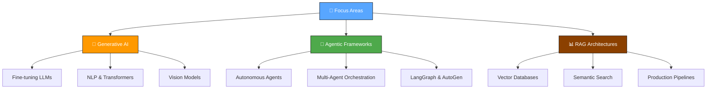

Matrix Background Animation -->[](https://www.youtube.com/watch?v=SDkAGkd4NLc

<div align="center">


# 👨💻 Muhammad Abdullah

**Machine Learning & Agentic AI Engineer** | LLMs · Multi-Agent Workflows · RAG · Generative AI

<a href="https://github.com/Muhammad08-dot">
  
</a>

[](https://muhammad08.vercel.app/)
[](mailto:mabdullahramday08@gmail.com)
[](https://linkedin.com/in/muhammad-abdullah-ramday)
[](https://github.com/Muhammad08-dot)

<br>


</div>

---

<div align="center">

### 🧭 Quick Navigation

[📊 Stats](#-github-stats) · [👋 About](#-about-me) · [🛠️ Tech Stack](#️-tech-stack) · [💡 Competencies](#-core-competencies) · [🚀 Projects](#-featured-projects) · [🗺️ Roadmap](#️-roadmap--current-focus)

</div>

---

<div align="center">

</div>

## 📊 GitHub Stats

<div align="center">


<br>


<br>


</div>

---

<div align="center">

</div>

## 👋 About Me

```python
class MLEngineer:
    def __init__(self):
        self.name = "Muhammad Abdullah"
        self.role = "AI/ML Engineer & Agentic Systems Builder"
        self.location = "Faisalabad, Pakistan 🇵🇰"
        
        self.focus_areas = [
            "🧠 Designing scalable RAG architectures",
            "🤖 Orchestrating Multi-Agent Workflows",
            "📊 Fine-tuning LLMs for domain-specific tasks",
            "⚡ Optimizing ML pipelines for production"
        ]
        
        self.currently_learning = ["Advanced Generative AI", "Agentic Frameworks (LangGraph, AutoGen)", "MLOps"]
        self.motto = "Automating the future, one intelligent agent at a time"

    def collaborate(self):
        return "Open to AI Research and Open Source ML Projects!"

abdullah = MLEngineer()
```

---

<div align="center">

</div>

## 🛠️ Tech Stack

<div align="center">

<a href="https://skillicons.dev">
  
</a>

<br><br>

<table align="center" width="100%">
<tr>
<td valign="top" width="25%" align="center">

**Languages**<br><br>
<br>
<br>


</td>
<td valign="top" width="25%" align="center">

**AI / ML Libraries**<br><br>
<br>
<br>
<br>
<br>
<br>


</td>
<td valign="top" width="25%" align="center">

**DevOps & Databases**<br><br>
<br>
<br>
<br>
<br>


</td>
<td valign="top" width="25%" align="center">

**Tools**<br><br>
<br>
<br>
<br>
<br>


</td>
</tr>
</table>
</div>

---

<div align="center">

</div>

## 💡 Core Competencies

<table>
<tr>
<td valign="top" width="33%">

### 🤖 Agentic Systems & GenAI

<div align="center">  


</div>
<br>
Building autonomous agents, semantic search engines, and complex LLM-driven applications.

</td>
<td valign="top" width="33%">

### 🧠 Machine Learning

<div align="center">  
<a href="https://pytorch.org/" target="_blank"></a>
<a href="https://www.tensorflow.org/" target="_blank"></a>

</div>
<br>
Designing and training deep learning models for NLP, Computer Vision, and predictive analytics.

</td>
<td valign="top" width="33%">

### ⚙️ Data Eng & Deployment

<div align="center">  
<a href="https://www.docker.com/" target="_blank"></a>
<a href="https://github.com/" target="_blank"></a>
<a href="https://pandas.pydata.org/" target="_blank"></a>
</div>
<br>
Containerizing ML applications, data wrangling, and version control for robust deployments.

</td>
</tr>
</table>

---

<div align="center">

</div>

## 🚀 Featured Projects

> *A showcase of my recent work in AI, Machine Learning, and Agentic Systems.*

| Project | Description | Tech Stack | Repository |
|---|---|---|---|
| 🤖 **Multi-Agent Orchestrator** | A framework for deploying interacting AI agents to solve complex reasoning tasks. |   | [View on GitHub](https://github.com/Muhammad08-dot) |
| 📚 **Advanced RAG Engine** | Semantic search system using Vector Databases for precise document retrieval. |   | [View on GitHub](https://github.com/Muhammad08-dot) |
| 👁️ **Vision Analysis Pipeline** | Computer vision application for real-time object detection and classification. |   | [View on GitHub](https://github.com/Muhammad08-dot) |

*(Note: Replace the generic GitHub links with actual repository links once published!)*

---

<div align="center">

</div>

<details>
<summary><b>🔍 View My Repositories by Field & Features</b></summary>

<div align="center">

| Repository | Description / Field | Primary Language |
|---|---|---|
| **[-DataMate_AI-](https://github.com/Muhammad08-dot/-DataMate_AI-)** | DataMate AI is an autonomous, agentic "Junior Data Scientist" web application built with Streamlit and powered by OpenAI (GPT-4o) and Google Gemini. The agent allows users to upload local datasets (CSV, Excel, JSON) or connect directly to SQL/NoSQL databases (SQLite, PostgreSQL, MySQL, and Firebase Firestore). | Python |
| **[advanced-multi-agent-system-project](https://github.com/Muhammad08-dot/advanced-multi-agent-system-project)** | Advanced Multi-Agent System Orchestrator is a production-ready dashboard for managing and executing AI workflows across multiple agent frameworks. It provides a centralized Control Center to deploy, run, and monitor agents built with LangGraph, CrewAI, and CAMEL from a single interface.  | TypeScript |
| **[agentic-email-assistant](https://github.com/Muhammad08-dot/agentic-email-assistant)** | Agentic AI that autonomously reads and replies to emails. | Python |
| **[Agentic-Research-Bot](https://github.com/Muhammad08-dot/Agentic-Research-Bot)** | AI Research Paper Generator is a sophisticated Python-based tool that automates the creation of comprehensive, high-quality research papers. By leveraging the Google Gemini API for intelligent content generation and DuckDuckGo Search for real-time web data, it produces up-to-date academic content across multiple sections, including Abstracts . | Python |
| **[ai-legal-case-predictor](https://github.com/Muhammad08-dot/ai-legal-case-predictor)** | Predict case outcomes, analyze judicial precedents, and evaluate financial litigation risk using machine learning. | Python |
| **[ai-red-teaming-framework](https://github.com/Muhammad08-dot/ai-red-teaming-framework)** |  AI Red-Teaming Framework An advanced, autonomous framework for testing the security, safety, and robustness of Large Language Models. | Python |
| **[ai-research-assistant-project](https://github.com/Muhammad08-dot/ai-research-assistant-project)** | Here is an even shorter and more direct version:  ***  **AI Research Assistant** is a local-first academic search and synthesis tool built with **Next.js 16** and **React 19**. It searches **arXiv & CrossRef**, rates source credibility, and leverages **LangChain/OpenAI** to instantly generate structured literature reviews with one-click "BibTeX" | TypeScript |
| **[ai-waste-segregation](https://github.com/Muhammad08-dot/ai-waste-segregation)** | Edge-deployed Computer Vision System classifying Solid Waste into recyclable and non-recyclable streams in real-time. | TypeScript |
| **[ai_blog_to_podcast_agent](https://github.com/Muhammad08-dot/ai_blog_to_podcast_agent)** | 🎙️ Convert any blog post into a high-quality podcast! Powered by Google Gemini 2.5 Flash, Agno (Phidata), Firecrawl, and ElevenLabs. Features voice customization, multiple podcast styles (Casual, News, ELI5), and adjustable audio lengths. | Python |
| **[ai_chat_with_documents](https://github.com/Muhammad08-dot/ai_chat_with_documents)** | A privacy-first AI document chat application built with Next.js. Features hybrid support for local offline RAG using Ollama and cloud generation via the Google Gemini API, backed by a local SQLite database and Drizzle ORM. | TypeScript |
| **[ai_customer_support_agent-](https://github.com/Muhammad08-dot/ai_customer_support_agent-)** | A modern, AI-powered Customer Support Agent featuring an intelligent chat interface, an admin knowledge base, and a real-time analytics dashboard. | TypeScript |
| **[ai_dataset_discovery_plateform](https://github.com/Muhammad08-dot/ai_dataset_discovery_plateform)** | An AI-powered full-stack platform that uses Web-Augmented RAG discover, fact-check, clean, and convert global datasets via natural language search."If you need something even shorter (for a 1-line description): "AI-powered platform to discover, fact-check, and convert global datasets using Web-Augmented RAG. | TypeScript |
| **[ai_fraud_investigation_agent](https://github.com/Muhammad08-dot/ai_fraud_investigation_agent)** | An autonomous multi-agent system built with Pydantic AI and FastAPI that automates entity due diligence, cross-references physical & legal databases, and scores fraud risk across 7 dimensions. | Python |
| **[ai_medical_report_simplifier-](https://github.com/Muhammad08-dot/ai_medical_report_simplifier-)** | ClearPath is an AI-driven Next.js web application designed to translate complex clinical medical reports (such as blood tests and laboratory findings) into patient-friendly, plain language explanations. | TypeScript |
| **[ai_meeting_assistant](https://github.com/Muhammad08-dot/ai_meeting_assistant)** | A full-stack AI Meeting Assistant that uses Google Gemini and Firebase to automatically transcribe, summarize, and extract action items from your meeting audio files. | TypeScript |
| **[ai_university_merit_predictor](https://github.com/Muhammad08-dot/ai_university_merit_predictor)** | AI-Powered Pakistan University Merit Predictor & Multi-Agent Admission Guide built with Next.js 16, Google Gemini API, and Roman Urdu AI Assistant. | TypeScript |
| **[autodev-agent](https://github.com/Muhammad08-dot/autodev-agent)** | Autonomous Software Engineering agent using LangGraph and Docker. | Python |
| **[autonomous-ai-startup-builder](https://github.com/Muhammad08-dot/autonomous-ai-startup-builder)** | 🚀 Autonomous AI Startup Builder An AI-powered Next.js application that transforms any raw business idea into a comprehensive Startup Plan in minutes. | TypeScript |
| **[autonomous-research-agent](https://github.com/Muhammad08-dot/autonomous-research-agent)** | Multi-Agent Research Crew with Self-Reflection Loops, Long-Term Memory & Report Generation. | Python |
| **[autonomous-trading-system](https://github.com/Muhammad08-dot/autonomous-trading-system)** | Autonomous Trading System using Deep Q-Learning, Technical Analysis Indicators, and Real-Time Paper Trading Simulation. | TypeScript |
| **[blind-ai-companion](https://github.com/Muhammad08-dot/blind-ai-companion)** | Wearable-integrated Vision-Language AI assistant for the blind providing scene description, obstacle detection, and document reading. | TypeScript |
| **[camel_ai_projects_mid-advance](https://github.com/Muhammad08-dot/camel_ai_projects_mid-advance)** | "This repository is a curated collection of 10 AI agent applications built using the CAMEL (Communicative Agents for 'Mind' Exploration of Large Scale Language Model Society) framework. | Python |
| **[codebase-rag-assistant](https://github.com/Muhammad08-dot/codebase-rag-assistant)** | Codebase RAG Assistant Chat with your entire codebase using advanced Retrieval-Augmented Generation. | Python |
| **[crewai-marketing-team](https://github.com/Muhammad08-dot/crewai-marketing-team)** | Multi-agent marketing team workflow using CrewAI. | Python |
| **[dataset_analytica](https://github.com/Muhammad08-dot/dataset_analytica)** | 🚀 Dataset Analytica is an interactive Python utility designed to seamlessly search, download, and clean raw Kaggle datasets on the fly. | Python |
| **[Docu-Mind-AI](https://github.com/Muhammad08-dot/Docu-Mind-AI)** | 🧠 DocuMind AI — Enterprise Multilingual RAG Workspace. Chat with your documents in English & Urdu. Features hybrid search (BM25 + Semantic), cross-encoder reranking, source citations, and anti-hallucination guardrails. Built with React, FastAPI, LangChain, and Qdrant. | TypeScript |
| **[E-Learning-Plateforms-site](https://github.com/Muhammad08-dot/E-Learning-Plateforms-site)** | EduNova is a high-performance, visually stunning e-learning platform built with React 19, Vite 7, and Tailwind CSS 4. It delivers a seamless learning experience where students can explore courses, track progress, and gain real-world skills from industry experts. | TypeScript |
| **[Face-Recognition-System](https://github.com/Muhammad08-dot/Face-Recognition-System)** | A real-time Face Detection & Recognition System built with Python and OpenCV. This project captures live video, detects faces, and recognizes individuals through a clean and modern interface. | Python |
| **[federated-learning-simulation](https://github.com/Muhammad08-dot/federated-learning-simulation)** | Privacy-preserving machine learning using PyTorch federated learning. | Python |
| **[gta-cheat-bot](https://github.com/Muhammad08-dot/gta-cheat-bot)** | A Python-based overlay bot for Grand Theft Auto V that types cheat codes for you at lightning speed! It works by intercepting keystrokes and simulating keyboard input at the OS level, meaning it bypasses the game's DirectInput seamlessly and prevents issues like weapon switching while typing. | Python |
| **[jarvis-voice-assistant](https://github.com/Muhammad08-dot/jarvis-voice-assistant)** | Voice control assistant using Porcupine wake word detection & speech recognition. Open/close 15+ apps with voice commands. Python-based, cross-platform. python voice-assistant jarvis speech-recognition porcupine voice-control automation ai-assistant windows cross-platform | Python |
| **[khidmat_app](https://github.com/Muhammad08-dot/khidmat_app)** | Khidmat (خدمت) is Pakistan’s AI-powered informal economy platform connecting skilled workers with customers via a 7-agent AI system.  Built for the Google Antigravity Hackathon, it uses Gemini 2.0 Flash for multilingual intent parsing, smart matching, dynamic pricing, booking automation, follow-ups, and AI-driven dispute resolution — all in one  | TypeScript |
| **[kisan-sahayak-ai](https://github.com/Muhammad08-dot/kisan-sahayak-ai)** | Production-Grade Multilingual AI Advisor for Crop Disease Diagnosis, Smart Irrigation & Market Intelligence. | Python |
| **[langgraph_projects_mid-advance](https://github.com/Muhammad08-dot/langgraph_projects_mid-advance)** | LangGraph Projects (Mid-to-Advanced) This repository contains a collection of 5 multi-agent AI workflows built with LangGraph to automate real-world tasks. | Python |
| **[LeadBot_AI](https://github.com/Muhammad08-dot/LeadBot_AI)** | 🤖 LeadBot AI — Your autonomous B2B lead generation assistant. Type what you need → AI agents scrape Google Maps → Get verified, CRM-ready leads exported as CSV. Built with React + TypeScript + Gemini AI + SerpAPI. | TypeScript |
| **[llm-finetuning-pipeline](https://github.com/Muhammad08-dot/llm-finetuning-pipeline)** | Memory-efficient LLM fine-tuning pipeline using HuggingFace Transformers and PEFT/LoRA. | Python |
| **[machine-learning-project-roadmap](https://github.com/Muhammad08-dot/machine-learning-project-roadmap)** | A modern, interactive guide and roadmap for various Machine Learning domains built with React, Vite, and TypeScript. | TypeScript |
| **[Medora_AI](https://github.com/Muhammad08-dot/Medora_AI)** | Bilingual (Urdu/Eng) Hospital LMS with clinical discussion boards & Gemini 2.5 AI daily briefs. | TypeScript |
| **[missing-person-finder](https://github.com/Muhammad08-dot/missing-person-finder)** | Facial Recognition & Vector Search Platform for Identifying Missing Persons across CCTV Streams. | TypeScript |
| **[multi-modal-medical-diagnosis](https://github.com/Muhammad08-dot/multi-modal-medical-diagnosis)** | AI-powered medical diagnosis assistant combining vision models, symptom analysis, and RAG literature retrieval. | Python |
| **[nextjs-saas-dashboard](https://github.com/Muhammad08-dot/nextjs-saas-dashboard)** | Premium SaaS dashboard built with Next.js and TailwindCSS. | Python |
| **[notion_mcp_agent](https://github.com/Muhammad08-dot/notion_mcp_agent)** | A terminal-based AI agent that lets you read, write, and manage your Notion workspace using plain English. Powered by OpenAI or Google Gemini via the Model Context Protocol (MCP) and the Agno framework — with persistent memory, automatic page discovery, and no manual setup required. | Python |
| **[omni-rag-engine](https://github.com/Muhammad08-dot/omni-rag-engine)** | Real-Time Multimodal Video Search engine using Whisper, CLIP, and Qdrant. | Python |
| **[on-device-private-ai-assistant](https://github.com/Muhammad08-dot/on-device-private-ai-assistant)** | 100% offline, privacy-first AI assistant powered by local LLMs and encrypted vector storage. | Python |
| **[personal_portfolio_](https://github.com/Muhammad08-dot/personal_portfolio_)** | The personal portfolio and digital terminal of an AI Engineer, crafted with React 19, Three.js, and Framer Motion. | TypeScript |
| **[predictive-maintenance-ml](https://github.com/Muhammad08-dot/predictive-maintenance-ml)** | Predictive maintenance using Random Forest on IoT data. | Python |
| **[real-time-financial-news-bot](https://github.com/Muhammad08-dot/real-time-financial-news-bot)** | Automated financial news stream ingestion, FinBERT sentiment scoring, and paper-trading execution. | Python |
| **[rl-stock-trader](https://github.com/Muhammad08-dot/rl-stock-trader)** | Distributed Deep Reinforcement Learning stock trader using Ray RLlib and PyTorch. | Python |
| **[rozgor_bot](https://github.com/Muhammad08-dot/rozgor_bot)** | **RozgarBot – AI Career & Opportunity Finder for Pakistan** is an AI-powered assistant that helps Pakistani students and job seekers discover jobs, internships, courses, and scholarships with city-level accuracy. It uses **RAG with Google Gemini API** over a PostgreSQL database to deliver accurate, cited answers in both English and Roman Urdu.  | TypeScript |
| **[self-improving-ai-agent](https://github.com/Muhammad08-dot/self-improving-ai-agent)** | An autonomous agent that leverages the Reflexion pattern and long-term memory to iteratively improve its performance. | Python |
| **[soc-copilot-ai](https://github.com/Muhammad08-dot/soc-copilot-ai)** | Cybersecurity Security Operations Center (SOC) Copilot for Log Anomaly Detection & MITRE ATT&CK RAG. | TypeScript |
| **[synthetic-data-generation-platform](https://github.com/Muhammad08-dot/synthetic-data-generation-platform)** | Enterprise-grade platform for generating realistic, privacy-preserving datasets for machine learning. | Python |
| **[urdu-mental-health-bot](https://github.com/Muhammad08-dot/urdu-mental-health-bot)** | Culturally-Aware Anonymous CBT Mental Health Counseling AI with Emergency Crisis Safety Engine. | Python |
| **[vision-data-extractor](https://github.com/Muhammad08-dot/vision-data-extractor)** |  Vision Data Extractor Extract structured JSON data from any document or image using Vision Language Models. | Python |
| **[voice-first-ai-assistant](https://github.com/Muhammad08-dot/voice-first-ai-assistant)** | A futuristic, fully voice-driven AI interface for seamless human-computer interaction. | Python |
| **[women-safety-ai](https://github.com/Muhammad08-dot/women-safety-ai)** | Real-time Edge AI System detecting danger, SOS gestures, and audio distress cues for Women's Safety. | TypeScript |

</div>
</details>

---

<div align="center">

</div>

## 🗺️ Roadmap & Current Focus



---

<div align="center">

## 🐍 GitHub Contribution Snake

<picture>
  <source media="(prefers-color-scheme: dark)" srcset="https://raw.githubusercontent.com/Muhammad08-dot/Muhammad08-dot/output/github-contribution-grid-snake-dark.svg" />
  <source media="(prefers-color-scheme: light)" srcset="https://raw.githubusercontent.com/Muhammad08-dot/Muhammad08-dot/output/github-contribution-grid-snake.svg" />
  
</picture>

<br>

<br>

### ✨ *"AI will not replace you. A person using AI will. The future belongs to those who build it."*

<br>

[](mailto:mabdullahramday08@gmail.com)
[](https://linkedin.com/in/muhammad-abdullah-ramday)
[](https://muhammad08.vercel.app/)


</div>
