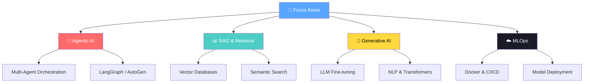

<div align="center">


# 🧑‍💻 Muhammad Abdullah

**AI/ML Engineer & Agentic AI Explorer** | Python · PyTorch · TensorFlow · LangChain · RAG · Multi-Agent Systems

<a href="https://github.com/Muhammad08-dot">
  
</a>

[](mailto:mabdullahramday08@gmail.com)
[](https://linkedin.com/in/muhammad-abdullah-ramday)
[](https://muhammad08.vercel.app/)
[](https://github.com/Muhammad08-dot)

<br>


</div>

---

<div align="center">

### 🧭 Quick Navigation

[📊 Stats](#-github-stats) · [👋 About](#-about-me) · [🛠️ Tech Stack](#-ai--ml-tech-stack--tools) · [💡 Competencies](#-core-competencies) · [🎯 Currently Working On](#-currently-working-on) · [🐍 Snake](#-snake-animation)

</div>

---

<div align="center">

</div>

## 📊 GitHub Stats

<div align="center">


<br>


<br>


</div>

---

<div align="center">


<a href="https://github.com/Muhammad08-dot?tab=followers">
  
</a>
<a href="https://github.com/Muhammad08-dot?tab=repositories">
  
</a>

</div>

---

<div align="center">

</div>

## 👋 About Me

```yaml
name: Muhammad Abdullah
role: Machine Learning & Agentic AI Engineer
location: Faisalabad, Pakistan 🇵🇰
education: BS-AI @ National University of Modern Languages (NUML)

focus:
  - 🌱 Agentic Systems, LLMs, and RAG architectures
  - 🧠 Multi-Agent Workflows
  - 🔍 Semantic search & vector retrieval

currently_learning: [Generative AI, Agentic Systems, RAG, MLOps]
looking_to_collaborate: [AI Research, Open Source ML]
motto: "Automating the future, one intelligent agent at a time"
```

<div align="center">

**📫 Reach me at:** [mabdullahramday08@gmail.com](mailto:mabdullahramday08@gmail.com) &nbsp;·&nbsp; **🌐 Portfolio:** [muhammad08.vercel.app](https://muhammad08.vercel.app)

</div>

---

<div align="center">

</div>

## 🛠 AI / ML Tech Stack & Tools

<div align="center">

**Core Languages**


**AI / ML Frameworks**


**Data Science**


**Vector Databases (RAG)**


**DevOps / Cloud**


</div>

---

<div align="center">

</div>

## 💡 Core Competencies

<table>
<tr>
<td valign="top" width="33%">

### 🤖 AI & Agentic Systems

<div align="center">
<br><br>
<br><br>

</div>

</td>
<td valign="top" width="33%">

### 🧠 Machine Learning

<div align="center">
<a href="https://pytorch.org/" target="_blank"></a>
<a href="https://www.tensorflow.org/" target="_blank"></a>

</div>

</td>
<td valign="top" width="33%">

### ☁️ Data Engineering & Cloud

<div align="center">
<a href="https://aws.amazon.com/" target="_blank"></a>
<a href="https://www.docker.com/" target="_blank"></a>
<a href="https://github.com/" target="_blank"></a>
</div>

</td>
</tr>
</table>

---

<div align="center">

</div>

## 🎯 Currently Working On

<div align="center">

| 🧠 Generative AI | 🤖 Agentic Frameworks | 📊 Retrieval-Augmented Gen |
|:---:|:---:|:---:|
| Fine-tuning LLMs | Autonomous Agents | Vector Databases |
| NLP & Transformers | Multi-Agent Orchestration | Semantic Search |
| Vision Models | LangGraph & AutoGen | RAG Pipelines |

</div>



---

## 💬 Random Dev Quote

<p align="center">
  
</p>

---

<div align="center">

</div>

## 🐍 Snake Animation

<p align="center">
  <picture>
    <source media="(prefers-color-scheme: dark)" srcset="https://raw.githubusercontent.com/Muhammad08-dot/Muhammad08-dot/output/github-contribution-grid-snake-dark.svg" />
    <source media="(prefers-color-scheme: light)" srcset="https://raw.githubusercontent.com/Muhammad08-dot/Muhammad08-dot/output/github-contribution-grid-snake.svg" />
    
  </picture>
</p>

---

<div align="center">


<br>

### ✨ *"The best way to predict the future is to build it."* — Peter Drucker

<br>

### 🤝 Let's Build Something Together

[](mailto:mabdullahramday08@gmail.com)
[](https://linkedin.com/in/muhammad-abdullah-ramday)
[](https://github.com/Muhammad08-dot)

<br>


**⭐️ From [Muhammad08-dot](https://github.com/Muhammad08-dot) — Made with 💙 in Markdown**

</div>
