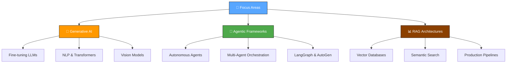

<!-- Matrix Background Animation (Optional: Can keep this or use Capsule Render) -->
<!-- [](https://www.youtube.com/watch?v=SDkAGkd4NLc) -->

<div align="center">


# 👨💻 Muhammad Abdullah

**Machine Learning & Agentic AI Engineer** | LLMs · Multi-Agent Workflows · RAG · Generative AI

<a href="https://github.com/Muhammad08-dot">
  
</a>

[](https://muhammad08.vercel.app/)
[](mailto:mabdullahramday08@gmail.com)
[](https://linkedin.com/in/muhammad-abdullah-ramday)
[](https://github.com/Muhammad08-dot)

<br>


</div>

---

<div align="center">

### 🧭 Quick Navigation

[📊 Stats](#-github-stats) · [👋 About](#-about-me) · [🛠️ Tech Stack](#️-tech-stack) · [💡 Competencies](#-core-competencies) · [🚀 Projects](#-featured-projects) · [🗺️ Roadmap](#️-roadmap--current-focus)

</div>

---

<div align="center">

</div>

## 📊 GitHub Stats

<div align="center">


<br>


<br>


</div>

---

<div align="center">

</div>

## 👋 About Me

```python
class MLEngineer:
    def __init__(self):
        self.name = "Muhammad Abdullah"
        self.role = "AI/ML Engineer & Agentic Systems Builder"
        self.location = "Faisalabad, Pakistan 🇵🇰"
        
        self.focus_areas = [
            "🧠 Designing scalable RAG architectures",
            "🤖 Orchestrating Multi-Agent Workflows",
            "📊 Fine-tuning LLMs for domain-specific tasks",
            "⚡ Optimizing ML pipelines for production"
        ]
        
        self.currently_learning = ["Advanced Generative AI", "Agentic Frameworks (LangGraph, AutoGen)", "MLOps"]
        self.motto = "Automating the future, one intelligent agent at a time"

    def collaborate(self):
        return "Open to AI Research and Open Source ML Projects!"

abdullah = MLEngineer()
```

---

<div align="center">

</div>

## 🛠️ Tech Stack

<div align="center">

<a href="https://skillicons.dev">
  
</a>

<br><br>

**Languages**


**AI / ML Frameworks**


**Data Science & Vision**


**Vector Databases (RAG)**


**DevOps & Tools**


</div>

---

<div align="center">

</div>

## 💡 Core Competencies

<table>
<tr>
<td valign="top" width="33%">

### 🤖 Agentic Systems & GenAI

<div align="center">  


</div>
<br>
Building autonomous agents, semantic search engines, and complex LLM-driven applications.

</td>
<td valign="top" width="33%">

### 🧠 Machine Learning

<div align="center">  
<a href="https://pytorch.org/" target="_blank"></a>
<a href="https://www.tensorflow.org/" target="_blank"></a>

</div>
<br>
Designing and training deep learning models for NLP, Computer Vision, and predictive analytics.

</td>
<td valign="top" width="33%">

### ⚙️ Data Eng & Deployment

<div align="center">  
<a href="https://www.docker.com/" target="_blank"></a>
<a href="https://github.com/" target="_blank"></a>
<a href="https://pandas.pydata.org/" target="_blank"></a>
</div>
<br>
Containerizing ML applications, data wrangling, and version control for robust deployments.

</td>
</tr>
</table>

---

<div align="center">

</div>

## 🚀 Featured Projects

> *A showcase of my recent work in AI, Machine Learning, and Agentic Systems.*

| Project | Description | Tech Stack | Repository |
|---|---|---|---|
| 🤖 **Multi-Agent Orchestrator** | A framework for deploying interacting AI agents to solve complex reasoning tasks. |   | [View on GitHub](https://github.com/Muhammad08-dot) |
| 📚 **Advanced RAG Engine** | Semantic search system using Vector Databases for precise document retrieval. |   | [View on GitHub](https://github.com/Muhammad08-dot) |
| 👁️ **Vision Analysis Pipeline** | Computer vision application for real-time object detection and classification. |   | [View on GitHub](https://github.com/Muhammad08-dot) |

*(Note: Replace the generic GitHub links with actual repository links once published!)*

---

<div align="center">

</div>

## 🗺️ Roadmap & Current Focus



---

<div align="center">

## 🐍 GitHub Contribution Snake

<picture>
  <source media="(prefers-color-scheme: dark)" srcset="https://raw.githubusercontent.com/Muhammad08-dot/Muhammad08-dot/output/github-contribution-grid-snake-dark.svg" />
  <source media="(prefers-color-scheme: light)" srcset="https://raw.githubusercontent.com/Muhammad08-dot/Muhammad08-dot/output/github-contribution-grid-snake.svg" />
  
</picture>

<br>

<br>

### ✨ *"AI will not replace you. A person using AI will. The future belongs to those who build it."*

<br>

[](mailto:mabdullahramday08@gmail.com)
[](https://linkedin.com/in/muhammad-abdullah-ramday)
[](https://muhammad08.vercel.app/)


</div>
